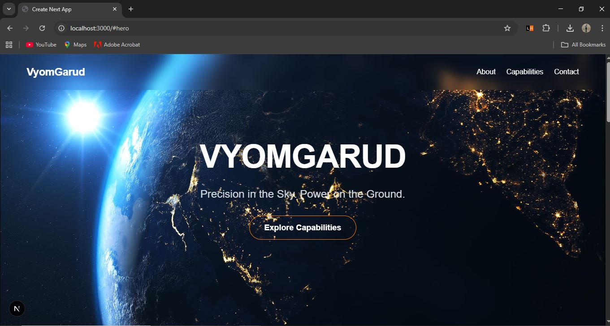
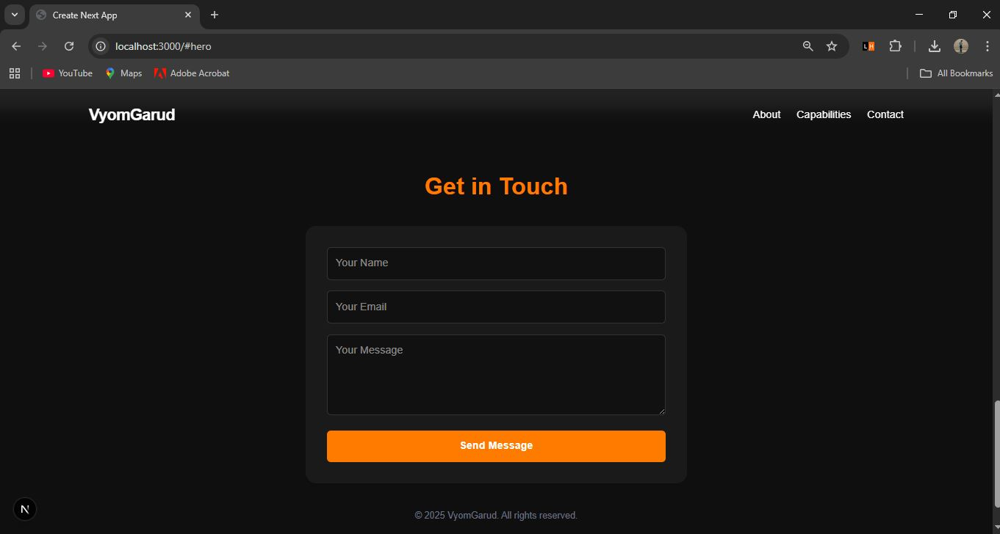
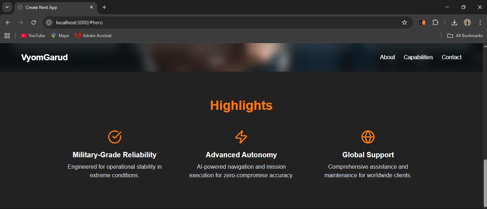

VyomGarud Landing Page

A modern, responsive landing page for VyomGarud, a UAV / drone systems company with a military-grade, professional identity. The page is designed to be bold, clean, and persuasive, highlighting the company’s capabilities and products.

Features

* Hero section with company name, tagline, CTA, and bold visuals
* About section summarizing VyomGarud’s mission
* Capabilities / Products section with 3–4 cards
* Highlights section with 3 key features
* Contact / Footer section with simple form and links
* Responsive design for mobile, tablet, and desktop
* Subtle animations using CSS / Framer Motion

Tech Stack

* **Framework:** React.js / Next.js
* **Styling:** Tailwind CSS
* **Animations:** Framer Motion (optional)
* **Fonts:** Poppins, Inter, or Montserrat

Project Structure

vyomgarud-landing/
├─ public/           
├─ src/
│  ├─ components/    
│  ├─ pages/         
│  ├─ styles/        
├─ package.json
├─ tailwind.config.js
└─ README.md

Setup & Installation

1.Clone the repository

git clone <repository-link>
cd vyomgarud-landing

2.Install dependencies**
bash
npm install

3. Run the project

npm run dev

4. Open in browse
   Visit http://localhost:3000

Design Choices

* Dark theme: Charcoal background with white text and orange accents (#ff7b00)
* Fonts: Poppins for headings, Inter for body text
* Aesthetic*: Modern, slightly military/futuristic, clean layout
* Animations: Subtle fade-ins and motion on scroll for hero and cards

Screenshots

*Add screenshots or GIFs here to showcase your landing page*

!Capabilities Section](./public/capabilities.JPG)

Deployment
live demo link: [https://your-demo-link.com](https://your-demo-link.com)
